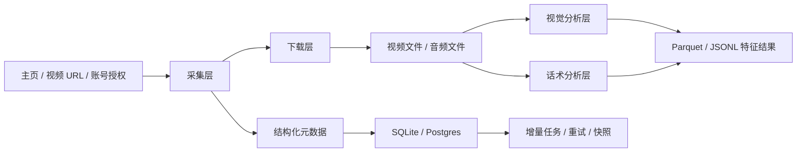
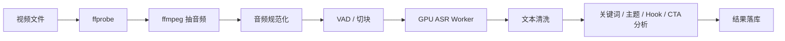

# 系统架构设计

## 总体目标

把系统拆成 4 个子系统：

1. 采集子系统
2. 下载子系统
3. 分析子系统
4. 存储与调度子系统

---

## 总体架构

---

## 一、采集层

### 输入

- 主页 URL
- 视频 URL
- 登录态 / cookies / 授权 token

### 输出

- `videos`
- `video_snapshots`
- `comments`
- `comment_replies`

### 模块建议

- `collector.platforms.douyin.official`
- `collector.platforms.douyin.browser`
- `collector.platforms.douyin.downloader_bridge`

---

## 二、下载层

### 责任

- 视频下载
- 下载状态更新
- 文件去重
- 文件哈希

### 设计建议

- 下载请求表与重试机制分开
- 文件路径与业务记录解耦
- 保留下载失败原因

---

## 三、视觉分析层

### 流程

1. 镜头切分
2. 采样帧
3. 画质与审美评估
4. 人脸检测与特征提取
5. 姿态关键点提取
6. 汇总为 shot / video 级特征

### 特征层级

#### frame 级

- 清晰度
- 亮度
- 人脸数
- 脸部朝向
- 姿态关键点

#### shot 级

- 平均清晰度
- 主要主体占比
- 镜头稳定性

#### video 级

- overall_aesthetic_score
- best_shot_score
- face_presence_ratio
- motion_stability_score

---

## 四、话术分析层

### 推荐 pipeline

### 并发策略

- `asyncio`：调度与状态管理
- `ProcessPoolExecutor`：CPU 预处理
- GPU 常驻进程：批量转写

---

## 五、数据层

### 建议存储

- 元数据：SQLite / Postgres
- 原始 JSON：JSONL
- 大规模分析：Parquet / DuckDB
- 媒体文件：本地磁盘 / 对象存储

### 核心实体

- `accounts`
- `videos`
- `video_snapshots`
- `comments`
- `comment_replies`
- `video_jobs`
- `transcript_segments`
- `analysis_result`

---

## 六、第一阶段落地范围

第一阶段只做：

1. 单平台单主页采集
2. 视频列表与评论快照入库
3. 视频下载
4. 视觉特征最小集
5. 话术分析最小集

这样能尽快得到一个能迭代的基础盘。
