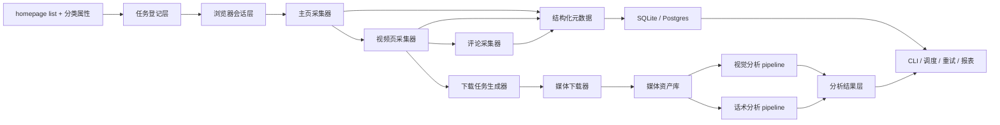

# 完整系统架构设计 + 表结构 + 模块划分

> 适用范围：一期仅做抖音；输入为多个主页 URL 列表，主页自带分类属性；无官方接口；允许人工配合登录 / 过验证码 / 导出浏览器状态；本地 Windows 主跑，后续可迁移到 Ubuntu。

---

## 1. 目标与约束

## 1.1 一期目标

构建一个**半自动、可批处理、可增量运行**的抖音数据采集与分析系统，支持：

- 多主页 URL 输入
- 主页分类属性管理
- 主页下视频发现
- 视频下载
- 视频互动快照采集
- 评论与回复尽量多抓取
- 为二期视觉分析与话术分析预留统一数据底座

---

## 1.2 已知约束

### 平台范围

- 一期只做抖音

### 接口条件

- 没有官方开放平台接口
- 主链路必须基于网页自动化 / 页面抓取 / 可人工辅助的半自动流程

### 人工配合边界

允许人工完成：

- 首次登录
- 验证码处理
- storage state / cookies 导出
- 某些异常任务的人工重试
- 数据质量抽查

### 部署环境

- 当前：本地 Windows
- 未来：可能迁移 Ubuntu

### 规模

- 一期主页数量：20 个以内
- 允许未来增加账号池

### 优先级

分析与话术依赖抓取，因此优先打通：

1. 主页与视频采集
2. 下载与快照
3. 评论与回复
4. 视觉分析
5. 话术分析

---

## 1.3 设计原则

1. **抓取链路优先可运行**
2. **所有重要数据尽量快照化**
3. **允许 incomplete，不伪造“全量成功”**
4. **人工介入点显式设计**
5. **模块低耦合，任务尽量并行**
6. **Windows 先可跑，避免 Linux-only 方案**
7. **后续迁移 Ubuntu 时尽量少改业务层**

---

## 2. 总体架构



---

## 3. 子系统划分

系统拆成 7 个子系统：

1. 输入与任务管理子系统
2. 浏览器会话与人工协作子系统
3. 主页 / 视频 / 评论采集子系统
4. 下载与媒体资产管理子系统
5. 结构化数据存储子系统
6. 视觉分析子系统
7. 话术分析子系统

---

## 3.1 输入与任务管理子系统

### 责任

- 读取主页列表
- 管理主页分类属性
- 生成 crawl job
- 控制增量 / 全量模式
- 记录任务状态与失败原因

### 输入

- CSV / JSON / YAML 的主页清单
- 每个主页的分类属性

### 输出

- `homepage_targets`
- `crawl_jobs`

---

## 3.2 浏览器会话与人工协作子系统

### 责任

- 管理 Playwright storage state
- 加载 cookies / session
- 检测登录失效
- 提示人工登录 / 验证码介入

### 设计结论

登录态优先采用：

> **Playwright storage state**

原因：

- 我最擅长
- 与浏览器自动化天然匹配
- 比纯 cookie 更稳
- 后续可同时支持 cookie 导入

### 人工介入点

- `session init`
- `captcha required`
- `session expired`
- `manual retry required`

---

## 3.3 主页 / 视频 / 评论采集子系统

### 主页采集

目标：

- 进入主页
- 滚动加载作品列表
- 获取公开视频 URL / video_id / 发布时间 / 封面 / 标题（若页面可取）
- 建立主页与视频关联

### 视频页采集

目标：

- 打开视频详情页
- 获取互动数：
  - 播放
  - 点赞
  - 评论
  - 转发
- 记录为快照

### 评论采集

策略：

- 先实用可用
- 尽量展开更多评论和回复
- 翻页 / 滚动尽量抓
- 明确记录 incomplete

### 输出

- `videos`
- `video_snapshots`
- `comments`
- `comment_replies`

---

## 3.4 下载与媒体资产管理子系统

### 责任

- 为视频生成下载任务
- 调用 downloader 主链路
- `yt-dlp` 作为兜底
- 校验文件完整性
- 记录哈希、路径、大小、状态

### 下载策略

主链路：

- 专用抖音 downloader 适配器

兜底：

- `yt-dlp`

失败时：

- 保留 video_url
- 标记失败原因
- 允许重试

---

## 3.5 结构化数据存储子系统

### 责任

- 管理业务主表
- 保存原始 JSON
- 保存任务状态
- 支持增量抓取与分析

### 一期建议

- 默认 SQLite
- 结构设计向 Postgres 兼容

---

## 3.6 视觉分析子系统

### 依赖前置

- 视频文件已下载

### 目标

- 帧采样
- 镜头切分
- 画面质量
- 人脸特征
- 姿态特征
- video-level 聚合

### 推荐技术

- `OpenCV`
- `PySceneDetect`
- `pyiqa`
- `InsightFace`
- `DeepFace`
- `MMPose`

---

## 3.7 话术分析子系统

### 依赖前置

- 视频文件已下载

### 目标

- 抽音频
- ASR
- 切句
- 关键词
- 主题
- Hook / CTA / 结构分析

### 推荐技术

- `ffmpeg`
- `faster-whisper`
- `asyncio`
- `ProcessPoolExecutor`

---

## 4. 数据流设计

## 4.1 主数据流

1. 导入主页列表
2. 建立主页目标表
3. 创建 crawl job
4. 加载浏览器状态
5. 采主页视频列表
6. 为每个视频建立视频页抓取任务
7. 采集互动快照
8. 采评论与回复
9. 生成下载任务
10. 下载视频
11. 触发视觉分析 / 话术分析
12. 生成聚合分析结果

---

## 4.2 人工协作流


---

## 5. 表结构设计

以下为一期推荐核心表。

---

## 5.1 `homepage_targets`

主页输入源表。

| 字段 | 类型 | 说明 |
|---|---|---|
| id | bigint pk | 主键 |
| platform | varchar(32) | 固定为 douyin |
| homepage_url | text unique | 主页 URL |
| source_name | varchar(255) | 自定义名称 |
| category_lv1 | varchar(128) | 一级分类 |
| category_lv2 | varchar(128) | 二级分类 |
| tags_json | json/text | 扩展标签 |
| status | varchar(32) | active / paused / invalid |
| notes | text | 备注 |
| created_at | datetime | 创建时间 |
| updated_at | datetime | 更新时间 |

---

## 5.2 `crawl_sessions`

记录浏览器会话、登录状态、人工介入状态。

| 字段 | 类型 | 说明 |
|---|---|---|
| id | bigint pk | 主键 |
| session_name | varchar(128) | 会话名 |
| state_file_path | text | storage state 文件路径 |
| cookie_file_path | text nullable | cookie 文件路径 |
| login_status | varchar(32) | valid / expired / unknown |
| last_manual_login_at | datetime nullable | 最近人工登录时间 |
| last_validation_at | datetime nullable | 最近验证时间 |
| remarks | text | 备注 |

---

## 5.3 `crawl_jobs`

总任务表。

| 字段 | 类型 | 说明 |
|---|---|---|
| id | bigint pk | 主键 |
| target_id | bigint fk | 对应主页 |
| job_type | varchar(64) | homepage_scan / video_detail / comment_scan / download / visual / speech |
| scope | varchar(32) | full / incremental |
| status | varchar(32) | pending / running / done / failed / partial |
| priority | int | 优先级 |
| attempt_count | int | 尝试次数 |
| needs_manual_help | bool | 是否需要人工介入 |
| error_code | varchar(64) nullable | 错误码 |
| error_message | text nullable | 错误信息 |
| started_at | datetime nullable | 开始时间 |
| finished_at | datetime nullable | 结束时间 |
| created_at | datetime | 创建时间 |

---

## 5.4 `videos`

视频主表。

| 字段 | 类型 | 说明 |
|---|---|---|
| id | bigint pk | 主键 |
| platform | varchar(32) | douyin |
| target_id | bigint fk | 来源主页 |
| video_id | varchar(128) | 平台视频 ID |
| video_url | text unique | 视频 URL |
| title | text nullable | 标题 |
| description | text nullable | 描述 |
| publish_at | datetime nullable | 发布时间 |
| author_name | varchar(255) nullable | 作者名 |
| cover_url | text nullable | 封面 |
| raw_json_path | text nullable | 原始 JSON 文件 |
| first_seen_at | datetime | 首次发现时间 |
| last_seen_at | datetime | 最近发现时间 |

---

## 5.5 `video_snapshots`

互动数据快照表。

| 字段 | 类型 | 说明 |
|---|---|---|
| id | bigint pk | 主键 |
| video_id_fk | bigint fk | 关联 videos.id |
| snapshot_at | datetime | 快照时间 |
| view_count | bigint nullable | 播放数 |
| like_count | bigint nullable | 点赞数 |
| comment_count | bigint nullable | 评论数 |
| share_count | bigint nullable | 转发数 |
| bookmark_count | bigint nullable | 若可见则记录 |
| capture_source | varchar(64) | browser / parser / manual_fix |
| is_estimated | bool | 是否估算值 |
| raw_json_path | text nullable | 原始响应 |

---

## 5.6 `comments`

评论主表。

| 字段 | 类型 | 说明 |
|---|---|---|
| id | bigint pk | 主键 |
| video_id_fk | bigint fk | 关联视频 |
| comment_platform_id | varchar(128) | 平台评论 ID |
| user_id | varchar(128) nullable | 评论用户 ID |
| nickname | varchar(255) nullable | 昵称 |
| content | text | 评论内容 |
| like_count | bigint nullable | 评论点赞数 |
| reply_count | bigint nullable | 回复数 |
| comment_at | datetime nullable | 评论时间 |
| is_author | bool nullable | 是否作者评论 |
| first_seen_at | datetime | 首次抓到时间 |
| last_seen_at | datetime | 最近抓到时间 |
| raw_json_path | text nullable | 原始 JSON |
| unique_hash | varchar(128) | 去重 hash |

建议唯一索引：

- `(video_id_fk, comment_platform_id)`

---

## 5.7 `comment_replies`

评论回复表。

| 字段 | 类型 | 说明 |
|---|---|---|
| id | bigint pk | 主键 |
| comment_id_fk | bigint fk | 关联 comments.id |
| reply_platform_id | varchar(128) | 平台回复 ID |
| user_id | varchar(128) nullable | 用户 ID |
| nickname | varchar(255) nullable | 昵称 |
| content | text | 回复内容 |
| like_count | bigint nullable | 点赞数 |
| reply_at | datetime nullable | 回复时间 |
| first_seen_at | datetime | 首次发现 |
| last_seen_at | datetime | 最近发现 |
| raw_json_path | text nullable | 原始 JSON |
| unique_hash | varchar(128) | 去重 hash |

---

## 5.8 `comment_scan_runs`

记录评论抓取完整性，避免误以为已抓全。

| 字段 | 类型 | 说明 |
|---|---|---|
| id | bigint pk | 主键 |
| video_id_fk | bigint fk | 关联视频 |
| run_at | datetime | 本次扫描时间 |
| top_level_count_seen | int | 看到的首层评论数量 |
| replies_count_seen | int | 看到的回复数量 |
| pagination_depth | int | 翻页深度 |
| expand_attempts | int | 展开回复次数 |
| is_incomplete | bool | 是否不完整 |
| stop_reason | varchar(64) | normal / captcha / timeout / blocked |
| notes | text | 备注 |

---

## 5.9 `download_jobs`

下载任务表。

| 字段 | 类型 | 说明 |
|---|---|---|
| id | bigint pk | 主键 |
| video_id_fk | bigint fk | 关联视频 |
| downloader | varchar(64) | adapter / yt_dlp |
| status | varchar(32) | pending / running / success / failed |
| attempt_count | int | 重试次数 |
| output_path | text nullable | 输出路径 |
| file_size | bigint nullable | 文件大小 |
| file_hash | varchar(128) nullable | 文件哈希 |
| error_message | text nullable | 错误信息 |
| started_at | datetime nullable | 开始 |
| finished_at | datetime nullable | 结束 |

---

## 5.10 `media_assets`

媒体资产表。

| 字段 | 类型 | 说明 |
|---|---|---|
| id | bigint pk | 主键 |
| video_id_fk | bigint fk | 关联视频 |
| asset_type | varchar(32) | video / audio / frame / cover |
| path | text | 文件路径 |
| format | varchar(32) | mp4 / wav / jpg |
| size_bytes | bigint nullable | 文件大小 |
| sha256 | varchar(128) nullable | 哈希 |
| created_at | datetime | 创建时间 |

---

## 5.11 `visual_analysis_jobs`

视觉分析任务表。

| 字段 | 类型 | 说明 |
|---|---|---|
| id | bigint pk | 主键 |
| video_id_fk | bigint fk | 关联视频 |
| status | varchar(32) | pending / running / done / failed |
| frame_sampling_rule | varchar(128) | 抽帧规则 |
| model_bundle | varchar(255) | 模型组合 |
| started_at | datetime nullable | 开始 |
| finished_at | datetime nullable | 结束 |
| error_message | text nullable | 错误 |

---

## 5.12 `visual_features`

视觉特征结果表。

| 字段 | 类型 | 说明 |
|---|---|---|
| id | bigint pk | 主键 |
| video_id_fk | bigint fk | 关联视频 |
| shot_index | int nullable | 镜头序号 |
| frame_ts_ms | int nullable | 帧时间 |
| feature_level | varchar(16) | frame / shot / video |
| aesthetic_score | float nullable | 审美分 |
| blur_score | float nullable | 模糊分 |
| brightness_mean | float nullable | 亮度均值 |
| face_count | int nullable | 人脸数量 |
| face_aesthetic_proxy | float nullable | 脸部审美代理分 |
| head_pose_json | json/text nullable | 头部姿态 |
| pose_json | json/text nullable | 姿态关键点 |
| motion_score | float nullable | 运动分 |
| stability_score | float nullable | 稳定性分 |
| raw_json_path | text nullable | 原始结果 |

---

## 5.13 `speech_jobs`

话术分析任务表。

| 字段 | 类型 | 说明 |
|---|---|---|
| id | bigint pk | 主键 |
| video_id_fk | bigint fk | 关联视频 |
| status | varchar(32) | pending / running / done / failed |
| asr_engine | varchar(64) | faster_whisper |
| language | varchar(16) nullable | 语言 |
| started_at | datetime nullable | 开始 |
| finished_at | datetime nullable | 结束 |
| error_message | text nullable | 错误 |

---

## 5.14 `transcript_segments`

转写分段表。

| 字段 | 类型 | 说明 |
|---|---|---|
| id | bigint pk | 主键 |
| video_id_fk | bigint fk | 关联视频 |
| segment_index | int | 分段序号 |
| start_ms | int | 起始时间 |
| end_ms | int | 结束时间 |
| text | text | 转写文本 |
| words_json | json/text nullable | 词级时间戳 |
| avg_logprob | float nullable | 平均概率 |
| no_speech_prob | float nullable | 无语音概率 |

---

## 5.15 `script_analysis_results`

话术结构分析结果表。

| 字段 | 类型 | 说明 |
|---|---|---|
| id | bigint pk | 主键 |
| video_id_fk | bigint fk | 关联视频 |
| keywords_json | json/text | 关键词 |
| topics_json | json/text | 主题 |
| structure_json | json/text | Hook / Problem / CTA 等结构 |
| summary | text nullable | 摘要 |
| updated_at | datetime | 更新时间 |

---

## 5.16 `artifacts`

原始产物索引表。

| 字段 | 类型 | 说明 |
|---|---|---|
| id | bigint pk | 主键 |
| related_type | varchar(64) | video / comment / visual / speech / job |
| related_id | bigint | 关联业务 ID |
| artifact_type | varchar(64) | html / json / screenshot / log / state |
| path | text | 文件路径 |
| created_at | datetime | 创建时间 |

---

## 6. 模块划分

建议代码结构：

```text
src/short_video_intel/
  cli/
  config/
  db/
  models/
  browser/
  collector/
  downloader/
  pipelines/
  visual/
  speech/
  scheduler/
  storage/
  utils/
```

---

## 6.1 `cli/`

### 责任

- 提供命令入口
- 参数解析
- 调用各 pipeline

### 预期命令

- `import-targets`
- `session-login`
- `crawl-homepages`
- `crawl-comments`
- `download-videos`
- `analyze-visual`
- `analyze-speech`
- `report-status`

---

## 6.2 `config/`

### 责任

- 读取配置文件
- 环境区分
- 路径管理
- 平台配置

### 内容

- 浏览器配置
- storage state 路径
- 下载器配置
- 数据目录
- 并发数

---

## 6.3 `db/`

### 责任

- 数据库连接
- migration
- repository 封装

### 建议

- 一期可从 SQLite + SQLAlchemy 起步

---

## 6.4 `models/`

### 责任

- ORM 模型
- DTO
- 任务状态模型

---

## 6.5 `browser/`

### 责任

- Playwright 启动
- storage state 管理
- 页面基础操作
- 登录检测
- 验证码中断与人工协作提示

### 子模块

- `session_manager.py`
- `page_helpers.py`
- `state_store.py`

---

## 6.6 `collector/`

### 责任

- 主页采集
- 视频详情采集
- 评论采集

### 子模块

- `targets_loader.py`
- `douyin_homepage_collector.py`
- `douyin_video_collector.py`
- `douyin_comment_collector.py`

---

## 6.7 `downloader/`

### 责任

- 任务转下载请求
- 调 downloader
- 文件校验

### 子模块

- `download_manager.py`
- `adapter_douyin_downloader.py`
- `adapter_ytdlp.py`
- `integrity.py`

---

## 6.8 `pipelines/`

### 责任

- 串起业务流程

### 子模块

- `crawl_pipeline.py`
- `download_pipeline.py`
- `visual_pipeline.py`
- `speech_pipeline.py`

---

## 6.9 `visual/`

### 责任

- 抽帧
- 镜头切分
- 画质分析
- 人脸分析
- 姿态分析
- 聚合

### 子模块

- `frame_sampler.py`
- `shot_detector.py`
- `quality_analyzer.py`
- `face_analyzer.py`
- `pose_analyzer.py`
- `visual_aggregator.py`

---

## 6.10 `speech/`

### 责任

- 音频抽取
- ASR
- 切句
- 关键词 / 主题 / 结构分析

### 子模块

- `audio_extract.py`
- `asr_worker.py`
- `segment_postprocess.py`
- `keywords.py`
- `topic_classifier.py`
- `script_structure.py`

---

## 6.11 `scheduler/`

### 责任

- 任务并发调度
- 重试
- 依赖顺序控制

### 一期建议

- 先做轻量本地任务调度
- 不急着引入 Celery / Kafka

---

## 6.12 `storage/`

### 责任

- HTML / JSON / 日志 / 截图落盘
- 统一路径命名
- 原始产物索引

---

## 6.13 `utils/`

### 责任

- 日志
- 时间
- 哈希
- 去重
- 重试工具

---

## 7. 并行推进设计

为了尽量并行推进，一期拆成 6 条主线：

### A 线：输入 / 数据底座
- 主页导入
- 表结构
- ORM
- 数据存储

### B 线：浏览器与会话
- Playwright
- storage state
- 登录检测
- 人工登录流程

### C 线：采集
- 主页采集
- 视频详情采集
- 评论采集

### D 线：下载
- 下载任务表
- downloader 适配
- 文件校验

### E 线：视觉分析
- 抽帧
- 质量特征
- 人脸
- 姿态

### F 线：话术分析
- 音频抽取
- ASR
- 文本结构分析

其中：

- A/B/C 可最先并行
- D 依赖 C 的视频 URL
- E/F 依赖 D 的视频文件

---

## 8. 风险与回退策略

## 8.1 主页结构变化

策略：

- 页面选择器集中管理
- 原始 HTML 截图落档
- 失败样本保留 artifact

## 8.2 登录失效 / 验证码

策略：

- 任务进入 `needs_manual_help`
- CLI 提示人工恢复会话

## 8.3 评论抓不全

策略：

- 永远记录 `comment_scan_runs`
- 标注 `is_incomplete`

## 8.4 下载失败

策略：

- 切换备用下载器
- 保留 URL 与失败原因

## 8.5 Windows 到 Ubuntu 迁移

策略：

- 浏览器、下载器、ffmpeg 路径全部配置化
- 业务逻辑不写死平台路径

---

## 9. 一期交付范围建议

一期建议严格控制到：

1. 主页列表导入
2. Playwright 登录态管理
3. 单主页 / 多主页视频发现
4. 视频详情与互动快照
5. 评论 / 回复尽量抓取
6. 视频下载
7. 基础 CLI
8. SQLite 数据底座

视觉分析与话术分析一期可以先出骨架与最小实现，不必一开始做太重。
